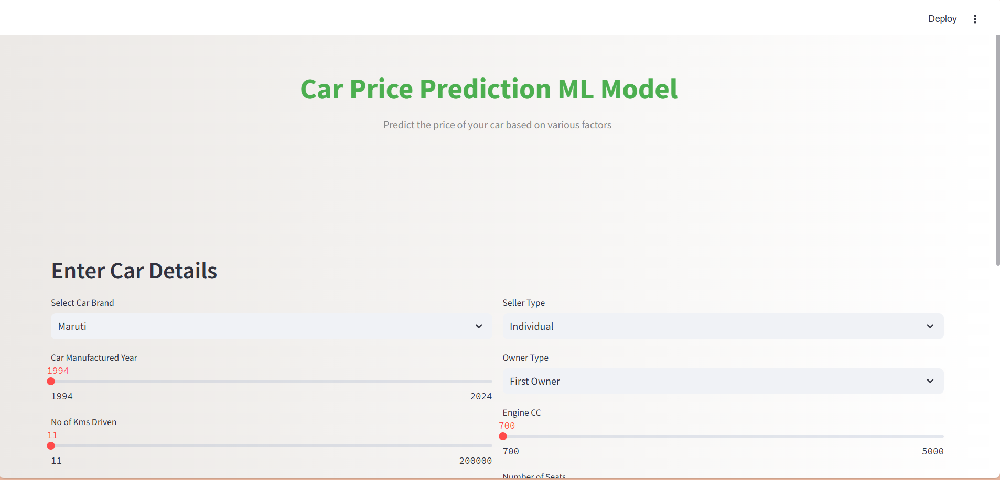
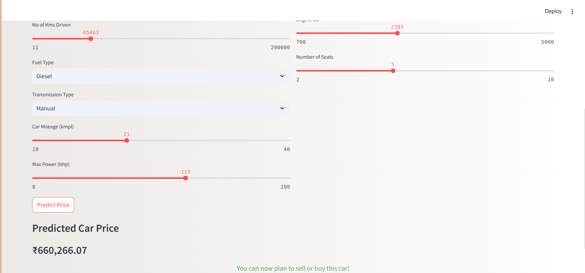

# PriceMyCar 🚗

## Overview 📋
**PriceMyCar** is a simple machine learning-based web application built using Streamlit that predicts the price of a car based on its attributes. This project is developed for educational purposes to demonstrate the workflow of data preprocessing, model building, and deployment using Python.

---

## Features ✨
- Predict car prices based on input features like brand, year, mileage, engine capacity, etc.
- User-friendly interface designed using **Streamlit**.
- Real-time car price prediction.

---

## Project Workflow 🛠️

### Step 1: Setting Up the Environment 🌐
1. **Python Environment:**
   - Installed Python 3.8.
   - Created a virtual environment using `venv`.
   - Activated the environment and installed required packages.
2. **Libraries Used:**
   - `pandas`
   - `numpy`
   - `streamlit`
   - `scikit-learn`

### Step 2: Data Preparation 📊
1. **Dataset Source:**
   - The dataset was obtained from a YouTube tutorial and downloaded from Google Drive.
   - Dataset filename: `Cardetails.csv`.
2. **Data Preprocessing:**
   - Checked for null values and handled them appropriately.
   - Removed duplicates.
   - Dropped unnecessary columns.
   - Replaced categorical values and converted them into numerical format.

### Step 3: Model Development 🤖
1. **Model Used:**
   - Linear Regression.
2. **Workflow:**
   - Trained the model on the preprocessed dataset.
   - Evaluated its performance.
   - Exported the model using `pickle` into a file named `model.pkl`.

### Step 4: Application Development 🌟
1. **Streamlit App:**
   - Built a user-friendly interface to input car details and predict the price.
   - Application file: `app.py`.
2. **Features Implemented:**
   - Dropdowns, sliders, and buttons for user inputs.
   - Display predicted car price dynamically.

---

## How It Looks 🖼️

Here are some screenshots of the application in action:




---

## How to Run the Project ▶️

1. Clone the repository:
   ```bash
   git clone https://github.com/Pratap0120/MLPRJ.git
   ```
2. Navigate to the project directory:
   ```bash
   cd MLPRJ
   ```
3. Install the required dependencies:
   ```bash
   pip install -r requirements.txt
   ```
4. Run the Streamlit app:
   ```bash
   streamlit run app.py
   ```

---

## How to Connect with Me 📬

Feel free to connect with me for any questions or feedback!

- **GitHub:** [Pratap0120](https://github.com/Pratap0120)
- **Email:** pratappawar.work@gmail.com
- **LinkedIn:** [Pratap Pawar](https://linkedin.com/in/pratap12)

---

## Acknowledgments 🙏

This project was inspired by a YouTube tutorial. The dataset was obtained from the provided Google Drive link in the tutorial. Special thanks to all open-source contributors and educators who made this learning experience possible!

---

## Disclaimer ⚠️
This project is created solely for learning purposes and is not intended for commercial use. The dataset and implementation details are based on publicly available resources.

